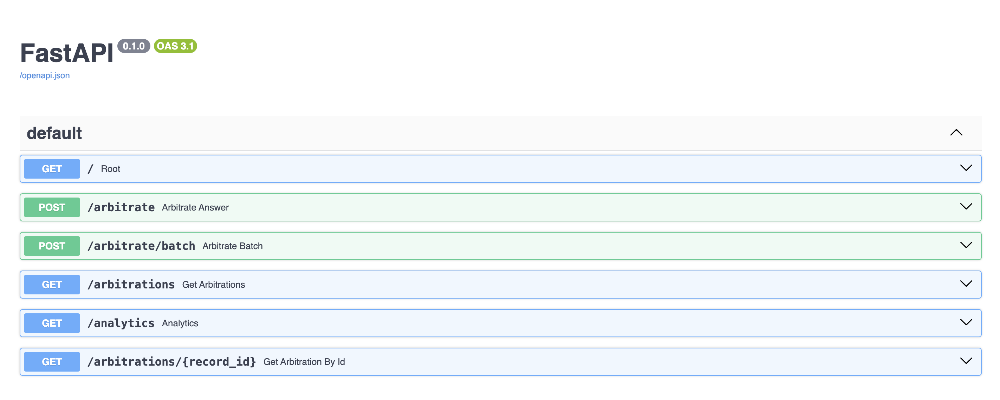
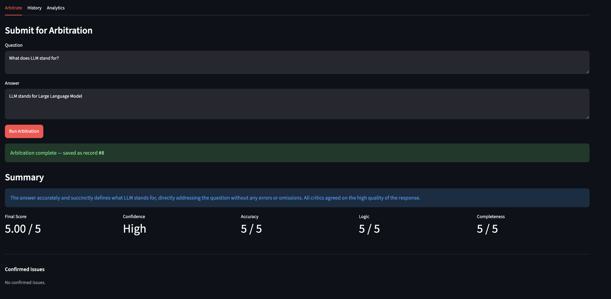
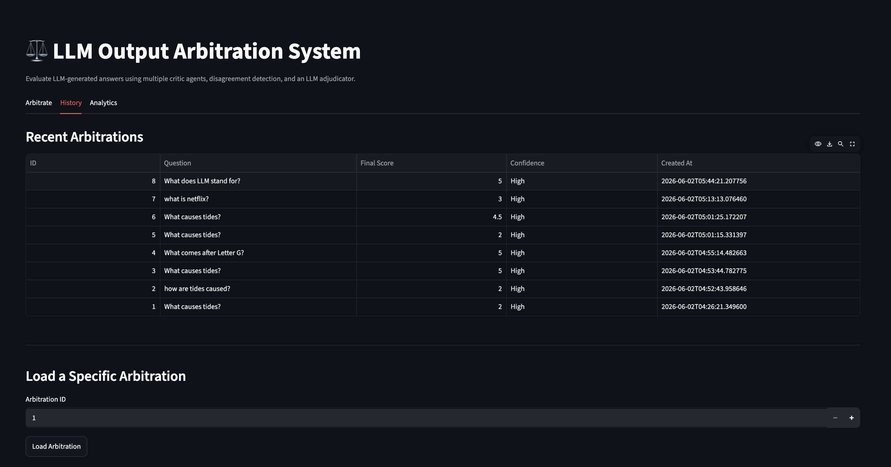
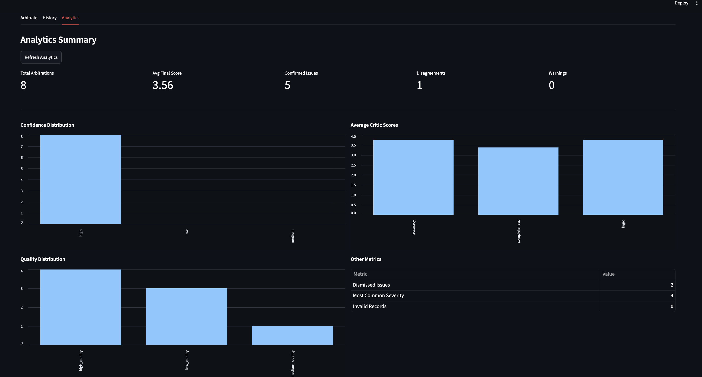

# LLM Output Arbitration System

A multi-agent evaluation system that reviews LLM-generated answers using multiple critic agents, disagreement detection, and an LLM adjudicator.

This project evaluates whether an AI-generated answer is accurate, logical, complete, and trustworthy. Instead of relying on a single evaluator, the system uses multiple specialized critics and then arbitrates between their opinions to produce a final verdict.

---

## Why This Project Exists

Large language models can generate fluent answers that sound correct but may contain factual errors, incomplete explanations, or weak reasoning.

This project addresses that problem by building an arbitration pipeline:

1. A user provides a question and an LLM-generated answer.
2. Multiple critic agents evaluate the answer from different perspectives.
3. The system detects disagreements between critics.
4. An LLM adjudicator reviews the critic reports.
5. The final result is stored, analyzed, and displayed through an API and dashboard.

The goal is to simulate a more reliable evaluation workflow for AI-generated content.

---

## Key Features

- Multi-critic LLM evaluation (accuracy, logic, completeness)
- Concurrent critic execution with graceful failure handling
- Rule-based disagreement detection
- LLM-based adjudicator with issue confirmation and dismissal
- Structured Pydantic response models with field validation
- FastAPI backend with interactive docs
- SQLite arbitration history storage
- Analytics endpoint with aggregate evaluation statistics
- Batch arbitration endpoint (up to 10 items)
- Streamlit dashboard
- CLI testing support

---

## Tech Stack

| Layer | Technology |
|---|---|
| Language | Python 3.11+ |
| API | FastAPI + Uvicorn |
| Dashboard | Streamlit |
| LLM | OpenAI API (gpt-4o-mini) |
| Validation | Pydantic v2 |
| Database | SQLite via SQLAlchemy 2.0 |
| Config | python-dotenv |

---

## System Overview

```
User Question + LLM Answer
        ↓
FastAPI / Streamlit / CLI
        ↓
Arbitration Orchestrator
        ↓
Accuracy Critic | Logic Critic | Completeness Critic   (concurrent)
        ↓
Graceful Failure Handler
        ↓
Disagreement Detector
        ↓
LLM Adjudicator
        ↓
Final Arbitration Result
        ↓
SQLite Storage → History · Analytics · Dashboard
```

---

## Project Structure

```
llm-arbitration/
├── app/
│   ├── adjudicators/
│   │   └── llm_adjudicator.py
│   ├── critics/
│   │   ├── accuracy.py
│   │   ├── logic.py
│   │   └── completeness.py
│   ├── models/
│   │   ├── arbitration_request.py
│   │   ├── arbitration_result.py
│   │   ├── critique.py
│   │   ├── disagreement.py
│   │   └── db_models.py
│   ├── repositories/
│   │   └── arbitration_repository.py
│   ├── services/
│   │   ├── analytics_service.py
│   │   └── openai_client.py
│   ├── api.py
│   ├── arbitration.py
│   ├── adjudicator.py
│   ├── database.py
│   └── disagreement_detector.py
├── main.py
├── streamlit_app.py
├── requirements.txt
├── .env              ← not committed
├── .gitignore
└── README.md
```

---

## How It Works

### 1. Input

```json
{
  "question": "What causes tides?",
  "answer": "Tides are mainly caused by the sun."
}
```

### 2. Critic Agents

Three critics run concurrently. Each returns a structured report:

```json
{
  "dimension": "accuracy",
  "score": 2,
  "confidence": 0.85,
  "issues": [
    {
      "quote": "Tides are mainly caused by the sun.",
      "problem": "The Moon is the primary driver of tides.",
      "severity": 4
    }
  ],
  "explanation": "The answer misidentifies the main cause of tides."
}
```

| Critic | Evaluates |
|---|---|
| **Accuracy** | Whether stated facts are correct |
| **Logic** | Whether reasoning is coherent and non-contradictory |
| **Completeness** | Whether the answer adequately addresses the question |

### 3. Disagreement Detection

Three rule-based checks flag inter-critic disagreements:

| Rule | Trigger |
|---|---|
| `score_gap` | Max − min critic score ≥ 2 |
| `severe_issue_vs_high_score` | One critic has a severity ≥ 4 issue while another scores ≥ 4 |
| `low_score_without_issues` | A critic scores ≤ 2 but reports no issues |

### 4. LLM Adjudicator

The adjudicator receives the original question, original answer, all three critic reports, detected disagreements, and any warnings from failed critics. It produces the final verdict — confirming genuine issues, dismissing overly strict ones, and scoring the answer holistically.

### 5. Final Result

```json
{
  "final_score": 2.0,
  "confidence_level": "high",
  "summary": "The answer incorrectly identifies the Sun as the main cause of tides.",
  "confirmed_issues": [
    {
      "quote": "Tides are mainly caused by the sun.",
      "problem": "The Moon is the primary driver of tides.",
      "severity": 4
    }
  ],
  "dismissed_issues": [],
  "disagreements": [],
  "warnings": [],
  "accuracy": { "...": "..." },
  "logic":    { "...": "..." },
  "completeness": { "...": "..." }
}
```

---

## API Endpoints

| Method | Path | Description |
|---|---|---|
| `GET` | `/` | Health check |
| `POST` | `/arbitrate` | Run single arbitration |
| `POST` | `/arbitrate/batch` | Run up to 10 arbitrations |
| `GET` | `/arbitrations` | List recent saved records |
| `GET` | `/arbitrations/{id}` | Get full stored result |
| `GET` | `/analytics` | Aggregate evaluation statistics |



### POST /arbitrate

**Request:**
```json
{
  "question": "What causes tides?",
  "answer": "Tides are mainly caused by the sun."
}
```

**Response:**
```json
{
  "id": 1,
  "result": {
    "final_score": 2.0,
    "confidence_level": "high",
    "summary": "...",
    "confirmed_issues": [],
    "dismissed_issues": [],
    "disagreements": [],
    "warnings": [],
    "accuracy": {},
    "logic": {},
    "completeness": {}
  }
}
```

### POST /arbitrate/batch

```json
[
  { "question": "What causes tides?", "answer": "Tides are mainly caused by the sun." },
  { "question": "What causes tides?", "answer": "Tides are caused mainly by the Moon's gravitational pull." }
]
```

Each item returns `"success": true` with `id` and `result`, or `"success": false` with an `error` message. Batch size is limited to 10 items.

---

## Setup Instructions

### 1. Clone the repository

```bash
git clone git@github.com:KritGupta7/llm-arbitration.git
cd llm-arbitration
```

### 2. Create virtual environment

```bash
python -m venv venv
source venv/bin/activate
```

### 3. Install dependencies

```bash
pip install -r requirements.txt
```

### 4. Create `.env`

```bash
OPENAI_API_KEY=your_api_key_here
```

> Do not commit this file.

### 5. Run the FastAPI backend

```bash
uvicorn app.api:app --reload
```

Interactive API docs: [http://127.0.0.1:8000/docs](http://127.0.0.1:8000/docs)

### 6. Run the Streamlit dashboard

Open a second terminal:

```bash
streamlit run streamlit_app.py
```

Dashboard: [http://localhost:8501](http://localhost:8501)

### 7. Run CLI mode

```bash
python main.py
```

---

## Dashboard

The Streamlit dashboard has three tabs:

| Tab | What it does |
|---|---|
| **Arbitrate** | Submit a question and answer, view final score, critic scores, confirmed issues, dismissed issues, disagreements, warnings, and per-critic details |
| **History** | Browse recent arbitration records; load any record by ID for full details |
| **Analytics** | Aggregate statistics — average scores, confidence distribution, quality distribution, issue counts, disagreement counts |

### Arbitrate Tab

Submit a question and answer to receive a full arbitration verdict with per-critic scores, confirmed issues, and warnings.



### History Tab

Browse all stored arbitration records and load any previous result by ID.



### Analytics Tab

View aggregate evaluation trends across all stored arbitrations, including confidence and quality distributions and average critic scores.



---

## Example Test Cases

### Bad answer

```
Question: What causes tides?
Answer:   Tides are mainly caused by the sun.
```

Expected: low final score, confirmed factual issue, accuracy critic flags severity 4–5.

### Good answer

```
Question: What causes tides?
Answer:   Tides are caused mainly by the gravitational pull of the Moon, with the Sun
          also contributing. The Moon's gravity pulls ocean water, creating bulges
          that we experience as high tides.
```

Expected: final score 4.0–5.0, no confirmed issues, strong accuracy and logic scores.

---

## Data Storage

SQLite is used for local storage via SQLAlchemy. Each record stores:

| Column | Type | Description |
|---|---|---|
| `id` | integer | Primary key |
| `question` | text | Original question |
| `answer` | text | Original answer |
| `result_json` | text | Full `ArbitrationResult` as JSON |
| `final_score` | float | Final score for fast querying |
| `confidence_level` | text | `"low"` / `"medium"` / `"high"` |
| `created_at` | datetime | UTC timestamp |

The database file is excluded from git:

```
arbitrations.db
*.db
```

---

## Security Notes

- API key is stored in `.env` and loaded with `python-dotenv`.
- The following files must never be committed: `.env`, `arbitrations.db`, `*.db`.

---

## Current Limitations

- Critic evaluations are LLM-generated and may vary slightly between runs.
- Critic calibration is prompt-based and may require tuning for specific domains.
- SQLite is for local development only, not production-scale deployment.
- Batch arbitration processes items sequentially.
- The Streamlit dashboard assumes the FastAPI backend is running locally.

---

## Future Improvements

- Add `pytest` test suite
- Add Docker support
- Add LangGraph workflow orchestration
- Add retry logic for invalid LLM JSON responses
- Add stronger structured output enforcement (`response_format`)
- Add export to CSV / JSON
- Deploy backend and dashboard
- Add additional critic types: safety, citation quality, helpfulness
- Add comparison mode for multiple LLM answers side-by-side
